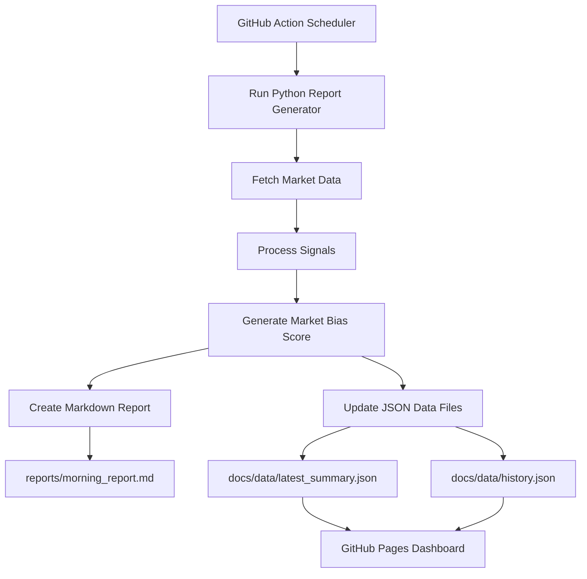

# 📈 Interactive Morning Market Brief

[](https://DeepPandya30.github.io/market-morning-brief/)


A fully automated **pre-market dashboard** for Indian market morning meetings.

This project fetches market data, scores market signals, generates a meeting-ready markdown report, and publishes an interactive GitHub Pages dashboard before the market opens.

> ⚠️ This project is for internal market preparation and discussion only. It is **not financial advice**.

---

## 🔗 Live Dashboard

👉 **Dashboard URL:**  
https://DeepPandya30.github.io/market-morning-brief/

---

## ✨ Key Highlights

- Automated market data collection
- Pre-market signal scoring
- Meeting-ready markdown report
- Interactive GitHub Pages dashboard
- Historical market bias tracking
- Charts, filters, copy buttons, markdown download, PDF print option
- Browser-based text-to-speech for quick morning briefing
- Scheduled GitHub Action run before 8:00 AM IST

---

## 📌 What This Dashboard Covers

### 🇮🇳 Indian Market View

- GIFT Nifty / NSE index snapshot, where available
- FII / DII cash market flow
- Nifty option-chain support, resistance and PCR
- Bank Nifty option-chain support, resistance and PCR
- India VIX
- India sector-wise market view

### 🌎 Global Markets

- **US Markets:** Nasdaq, Dow Jones, S&P 500
- **Europe Markets:** FTSE 100, CAC 40, DAX
- **Asia Markets:** Hang Seng, Nikkei 225

### 🛢️ Commodities

- Gold
- Silver
- Crude Oil WTI
- Brent Oil
- Copper

### ₿ Crypto Market

- Bitcoin
- Ethereum
- Solana
- Cardano
- Ripple

### 💱 Currency Market

- GBP/USD
- EUR/USD
- USD/CHF
- USD/JPY
- DXY
- USD/INR

### 📊 Signal Analytics

- Overall market bias
- Signal score breakdown
- Bullish / bearish / neutral signal classification
- Historical bias trend
- Meeting summary generation

---

## 🧭 Dashboard Sections

The interactive dashboard is divided into focused tabs:

| Tab | Purpose |
|---|---|
| **Overview** | Quick market summary, bias, score and meeting notes |
| **Global Markets** | US, Europe and Asia market snapshot with region filter |
| **Sectors** | Indian sector-wise market movement with search and filters |
| **Signals** | Detailed signal score breakdown |
| **History** | Historical bias score trend |
| **Full Report** | Complete markdown report for morning discussion |

---

## 🖥️ Interactive Dashboard Features

- Region-wise global market filter
- Sector search
- Positive / negative sector filter
- Signal status filter
- Auto-updating score charts
- Historical bias score line chart
- Copy meeting summary button
- Copy full markdown report button
- Download markdown report
- Print / save as PDF
- Browser text-to-speech:
  - Listen to meeting summary
  - Listen to full market report

---

## ⚙️ How It Works



---

## 🗂️ Project Structure

```text
market-morning-brief/
│
├── .github/
│   └── workflows/
│       └── morning-brief.yml
│
├── data/
│   └── processed/
│       ├── latest_summary.json
│       └── history.json
│
├── docs/
│   ├── index.html
│   └── data/
│       ├── latest_summary.json
│       └── history.json
│
├── reports/
│   └── morning_report.md
│
├── runtime dashboard/
│   └── index.html
│
├── scripts/
│   └── generate_report.py
│
├── requirements.txt
└── README.md
```

---

## 🚀 Local Run

### macOS / Linux

```bash
python -m venv .venv
source .venv/bin/activate
pip install --upgrade -r requirements.txt
python scripts/generate_report.py
open docs/index.html
```

### Windows PowerShell

```powershell
python -m venv .venv
.\.venv\Scripts\activate
pip install --upgrade -r requirements.txt
python scripts\generate_report.py
start docs\index.html
```

---

## 📤 Output Files

After running the script, the following files are generated or updated:

```text
reports/morning_report.md
runtime dashboard/index.html
docs/index.html
data/processed/latest_summary.json
data/processed/history.json
docs/data/latest_summary.json
docs/data/history.json
```

### File Purpose

| File | Purpose |
|---|---|
| `reports/morning_report.md` | Meeting-ready markdown report |
| `docs/index.html` | GitHub Pages dashboard |
| `docs/data/latest_summary.json` | Latest dashboard data |
| `docs/data/history.json` | Historical trend data |
| `data/processed/latest_summary.json` | Local processed latest summary |
| `data/processed/history.json` | Local processed historical summary |

---

## 🌐 GitHub Pages Setup

Use GitHub Pages with the following settings:

```text
Source: Deploy from a branch
Branch: main
Folder: /docs
```

After setup, the dashboard will be available at:

```text
https://DeepPandya30.github.io/market-morning-brief/
```

---

## ⏰ GitHub Action Schedule

The workflow runs **Monday to Friday at 7:50 AM IST**, so the dashboard is ready before the 8:00 AM market meeting.

```yaml
cron: "20 2 * * 1-5"
```

GitHub Actions uses UTC time.

```text
02:20 UTC = 07:50 IST
```

---

## 🧪 Manual GitHub Action Run

You can also trigger the workflow manually from GitHub:

```text
Repository → Actions → Morning Market Brief → Run workflow
```

This is useful when:

- You want to refresh the dashboard manually
- The scheduled workflow did not run
- You made changes to the report generator
- You want to test dashboard updates

---

## 🧾 Example Morning Workflow

1. GitHub Action runs at 7:50 AM IST.
2. Python script fetches market data.
3. Market signals are scored.
4. Markdown report is generated.
5. JSON files are updated.
6. Dashboard is published through GitHub Pages.
7. Team opens the dashboard before the morning meeting.
8. Summary can be copied, downloaded, printed, or played using text-to-speech.

---

## 🛠️ Troubleshooting

### Dashboard is showing old data

Try the following:

1. Refresh the browser.
2. Open the dashboard in incognito mode.
3. Check whether the latest GitHub Action completed successfully.
4. Confirm that files inside `docs/data/` were updated.
5. Wait a few minutes for GitHub Pages cache to refresh.

### GitHub Action did not run

Check:

- Workflow file exists inside `.github/workflows/`
- Cron syntax is valid
- Repository Actions are enabled
- Branch is set to `main`
- Workflow has permission to commit updated files

### Data is missing for some markets

Some market sources may be unavailable, delayed, rate-limited, or blocked temporarily. The dashboard is designed to continue generating the report with available data.

### Git push rejected

If your local branch is behind GitHub:

```bash
git pull --rebase origin main
git push origin main
```

---

## 🔐 Notes on Data Reliability

Market data availability may depend on:

- Exchange source availability
- Public API limits
- Website blocking or rate limits
- Market holidays
- Delayed global market feeds
- GitHub Actions network availability

The dashboard should be used as a discussion support tool, not as a trading recommendation system.

---

## 📍 Roadmap Ideas

- Add email or Telegram morning notification
- Add confidence score for each signal
- Add separate Nifty and Bank Nifty bias cards
- Add market holiday detection
- Add earnings / event calendar
- Add fear-greed style sentiment meter
- Add heatmap for sectors
- Add CSV export
- Add mobile-first dashboard improvements
- Add auto-generated PDF report

---

## ⚠️ Disclaimer

This project is created for **morning discussion and internal market preparation only**.

It does not provide investment advice, trading advice, buy/sell recommendations, or financial planning guidance. Always verify market data from official and trusted sources before making financial decisions.
